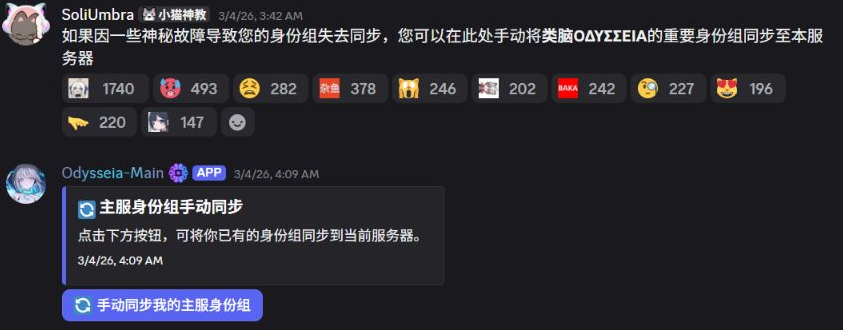
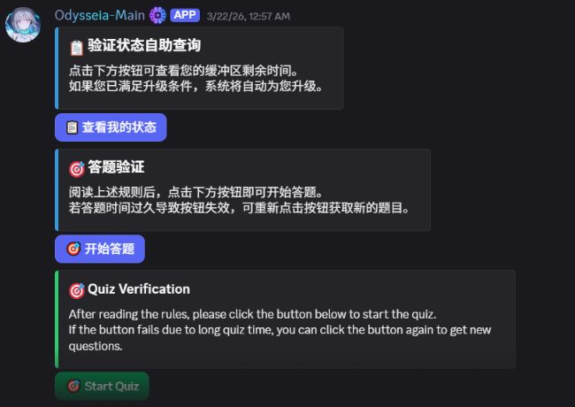

# Odysseia-Main: Guild Members feature evidence

Application ID: **1374372307916554351**.
Communities: **类脑ΟΔΥΣΣΕΙΑ** and **类脑ΙΛΙΑΣ**.
Inspected on **9 September 2026**.

Only **Guild Members** is requested. Message Content and Presence are disabled.
Screenshots are genuine existing interfaces, cropped to remove unrelated UI.

## Guild Members

### Automatic role synchronization

The operator's existing message explains that important roles from
类脑ΟΔΥΣΣΕΙΑ are synchronized into 类脑ΙΛΙΑΣ, with this manual recovery panel
available if synchronization fails.

The privileged-intent use case is the **automatic** path: the deployed bot
subscribes to member-join and member-role-update events and synchronizes configured
role changes without waiting for a slash command or button click. The manual
panel alone is not presented as proof that privileged access is required.

The live configuration contains one two-server synchronization group with
194 source and 135 destination role mappings. Read-only inspection of Discord's
actual audit log found bot actions with these reasons:

- 入服自动同步主服身份组（组: 类脑双服） — automatic role synchronization on join.
- 身份组同步: 监听同步（身份组新增） — propagation of an observed role addition.

These counts reflect configured mappings at inspection, not user counts.
No member identities or private message content are included here.

### Scheduled verification-role upgrades

The bot enumerates holders of configured buffer roles, checks their verification
time (or join time as a fallback), and moves eligible members to the verified
role after the waiting period. The status card describes this automatic upgrade.

Actual Discord audit records showed the bot adding 已验证 and removing 缓冲区
or 缓冲区-高级 with the reason 自动升级：缓冲区期满. This scheduled work does
not require each affected member to interact with the bot.

### Implementation references

- [Member joins and role-update synchronization](../../src/sync/cog.py)
- [Verification and scheduled role upgrades](../../src/verify/cog.py)
- [Current intent selection](../../main.py)
- [Privacy policy](../PRIVACY_POLICY.md)

## Current data scope

Message Content and Presence are disabled. Forum keyword filtering and legacy
hand-written punishment-history import are disabled. Moderation cleanup uses
message metadata only, with no message-body transcript. Message inputs received
through Discord interactions or messages the bot itself sends remain subject
to the privacy policy.

The former empty moderation attachment is not used as application evidence.
